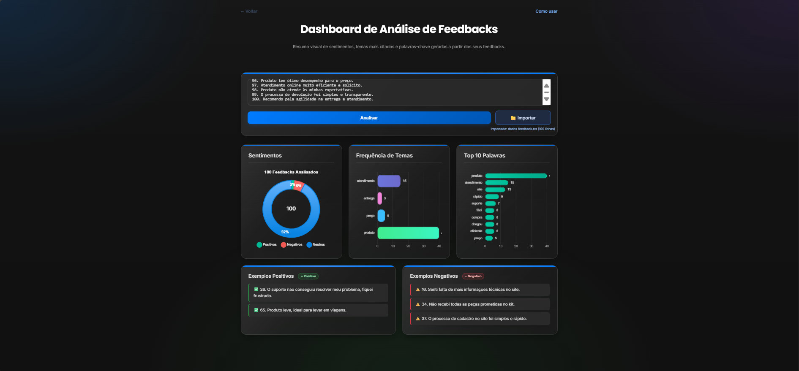

<!-- PORTFOLIO-FEATURED
title: Análise de Feedbacks 2.0
description: Aplicação full-stack para análise automatizada de comentários e avaliações, com importação de TXT/CSV, visualizações interativas e UX otimizada.
technologies: Python, Flask, JavaScript, HTML5, CSS3
demo: https://analise-feedback.vercel.app/
highlight: true
image: foto.png
-->

<p align="center">
  
</p>

<h1 align="center">📊 Análise de Feedbacks 2.0</h1>

<p align="center">
  <a href="https://opensource.org/licenses/MIT"></a>
  <a href="https://analise-feedbacks.vercel.app/"></a>
  <a href="https://vercel.com/"></a>
</p>

---

## 📑 Sumário

- [📌 Visão Geral](#-visão-geral)
- [✨ Funcionalidades](#-funcionalidades)
- [🛠️ Stack Tecnológica](#️-stack-tecnológica)
- [📂 Arquitetura](#-arquitetura)
- [🚀 Como Rodar Localmente](#-como-rodar-localmente)
- [🔌 Endpoints da API](#-endpoints-da-api)
- [📖 Guia de Uso](#-guia-de-uso)
- [⚠️ Boas Práticas e Limitações](#️-boas-práticas-e-limitações)
- [🧪 Testes](#-testes)
- [🗺️ Roadmap](#️-roadmap)
- [🤝 Contribuição](#-contribuição)
- [📜 Licença](#-licença)
- [🙏 Créditos](#-créditos)
- [🛠 Problemas Comuns](#-problemas-comuns)

---

## 📌 Visão Geral

Aplicação full‑stack para análise automatizada de comentários e avaliações, com suporte a importação de arquivos TXT/CSV e visualizações interativas.

O usuário pode colar feedbacks em um textarea ou importar arquivos. Em segundos, o dashboard exibe análise de sentimentos, frequência de temas, palavras‑chave e exemplos reais.


---

## ✨ Funcionalidades

- 📁 Importação de TXT/CSV para preenchimento automático.
- 🧠 Análise de Sentimentos (positivo, negativo, neutro) com gráfico de rosca.
- 📊 Frequência de Temas (ex.: entrega, produto, atendimento, preço) em gráfico de barras.
- 🔍 Top 10 Palavras (removendo stopwords).
- 💬 Exemplos dos feedbacks mais positivos e negativos.
- 📱 Dashboard responsivo e interativo.

---

## 🛠️ Stack Tecnológica

**Frontend**
- HTML5, CSS3, JavaScript (Vanilla)
- [Chart.js](https://www.chartjs.org/)

**Backend**
- Python 3.10+
- [Flask](https://flask.palletsprojects.com/)
- [NLTK](https://www.nltk.org/)
- [VADER Sentiment](https://github.com/cjhutto/vaderSentiment)

**Deploy**
- [Vercel](https://vercel.com/)

---

## 📂 Arquitetura

```text
/
├── api/
│   └── index.py          # Backend Flask
├── frontend/
│   ├── index.html
│   ├── script.js
│   └── style.css
├── docs/
│   └── screenshot-dashboard.png
├── requirements.txt
├── vercel.json
└── README.md
```

---

## 🚀 Como Rodar Localmente

### Pré‑requisitos
- Python 3.10+
- Node.js + npm (para Vercel CLI)
- Conta na Vercel (opcional para deploy)

### Passos (Windows PowerShell/Command Prompt)

```bash
# Clone o repositório
git clone <URL_DO_REPOSITORIO>
cd analise-feedbacks

# Instale a Vercel CLI (opcional, útil para dev/deploy)
npm install -g vercel

# Crie e ative o ambiente virtual Python
python -m venv .venv
.\.venv\Scripts\activate

# Instale dependências do backend
pip install -r requirements.txt

# Inicie o backend (porta 5001)
python -m flask --app api/index:app run --port 5001
```

No arquivo `frontend/script.js`, aponte a URL para o backend local:

```javascript
const response = await fetch('http://127.0.0.1:5001/api/index', {
  method: 'POST',
  headers: { 'Content-Type': 'application/json' },
  body: JSON.stringify({ text }),
});
```

Abra `frontend/index.html` no navegador.

> Dica: você pode rodar um servidor estático simples (ex.: VS Code Live Server) para evitar problemas de CORS em file://.

---

## 🔌 Endpoints da API

### POST /api/index

Corpo:

```json
{
  "text": "Feedback 1\nFeedback 2\n..."
}
```

Resposta (exemplo):

```json
{
  "sentiments": {"positivo": 10, "negativo": 5, "neutro": 3},
  "themes": {"produto": 8, "entrega": 5},
  "top_words": [["qualidade", 4], ["rápido", 3]],
  "examples": {"positive": ["Ótima qualidade!"], "negative": ["Demorou demais."]}
}
```

---

## 📖 Guia de Uso

- Cole feedbacks no textarea ou importe TXT/CSV.
- Clique em "Analisar" para gerar o dashboard.
- Explore gráficos e exemplos para insights rápidos.

---

## ⚠️ Boas Práticas e Limitações

- Arquivos em UTF‑8.
- Tamanho máximo recomendado: ~1 MB.
- CSV deve conter uma coluna de feedbacks (uma linha por feedback).

---

## 🧪 Testes

Ainda sem testes automatizados. Planejado para próximas versões.

---

## 🗺️ Roadmap

- [ ] Suporte a múltiplos idiomas
- [ ] Exportar relatórios em PDF
- [ ] Filtro por data

---

## 🤝 Contribuição

1. Faça um fork
2. Crie uma branch: `git checkout -b feature/minha-feature`
3. Commit: `git commit -m "feat: adiciona minha feature"`
4. Push: `git push origin feature/minha-feature`
5. Abra um Pull Request

---

## 📜 Licença

Este projeto está sob a licença [MIT](LICENSE).

---

## 🙏 Créditos

- Desenvolvido por [Lucas Andrade](https://github.com/dev-lucasandrade)
- Bibliotecas: NLTK, VADER, Chart.js

---

## 🛠 Problemas Comuns

| Erro                                         | Causa                           | Solução                             |
| -------------------------------------------- | ------------------------------- | ----------------------------------- |
| `flask não reconhecido`                      | Flask não instalado globalmente | Use `python -m flask`               |
| `OSError: [Errno 98] Address already in use` | Porta ocupada                   | Altere a porta (ex.: `--port 5002`) |
| CORS error                                   | Navegador bloqueando requisição | Use um servidor local ou `vercel dev` |

---

⭐ Se este projeto foi útil, deixe uma estrela e contribua!
